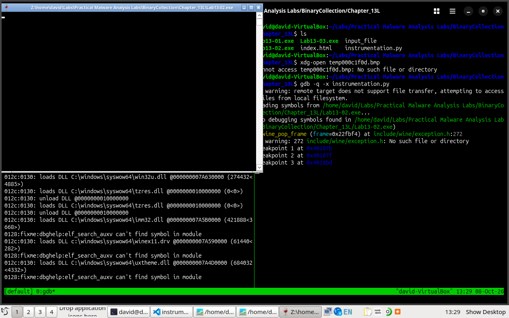

# Lab13-02.exe Walkthough
## Executive Summary
- This lab is not part of Crack-Me. However, some of the concepts I learned while analysing this malware sample could be invaluable when working on other malware samples.
## File Information
- **FileName:** *Lab13-02.exe*
- **SHA-256:** `598f21f1e6f4d5829ba8cfba19d361e09de510493df8472a605f46dbf7927030` 
- **File Type:**  PE32 executable for MS Windows 4.00 (console), Intel i386, 3 sections

## Tools used
- **OS:** Linux
- **Dissasembler:** ghidra, GNU Debugger
- **Script:** Python

# Walkthrough
## Static Analysis
### Import/Exports
- Key libraries imported by the malware sample include: `kernel32.dll`,`user32.dll`, and `gdi32.dll`. One external library that caught my attention was *gdi32.dll* since it is used in windows for managing graphical operations e.g. 2D-graphics, fonts etc

### Disassembly and Decompilation
- The program's main function is at `0x4018d8`. The function executes an infinite loop with two 5-second pauses.

```C
  do {
    Sleep(5000);
    FUN_run();
    Sleep(5000);
  } while( true );
```
- The function at `0x401851` contains the core logic of our malware. 

#### FUN_createBitmap
- One of the core functions in our sample is defined at `0x401070`. The function accepts 2 pointer parameters. The function utilises the *user32.dll* and *gdi32.dll* to create a bitmap.
```C
...
  local_50 = CreateCompatibleDC(DAT_004078c8);
  local_1c = CreateCompatibleBitmap(DAT_004078c8,local_20,local_8);
...
```
- Once the function executes, the function parameters are reassigned their values. The first parameter is the buffer address where the bitmap data is stored, and the second parameter is the size of the bitmap data

```C
...
  *buf_addr = local_54;
  *buf_size = dwBytes_00;
...
```

#### FUN_encode_decode
- The function defined at `0x40181f` contains the malware sample's encoding algorithm. Encoding is used by malware to hide their operations.
- The function calls another function defined at `0x401739`. This is the core encoding algorithm used by the malware sample. The malware uses a simple XOR encoding algorithm.

```ASM
...
        00401767 8b 45 0c        MOV        EAX,dword ptr [EBP + param_2]
        0040176a 8b 4d 08        MOV        ECX,dword ptr [EBP + param_1]
        0040176d 8b 10           MOV        EDX,dword ptr [EAX]
        0040176f 33 11           XOR        EDX,dword ptr [ECX]
        00401771 8b 45 08        MOV        EAX,dword ptr [EBP + param_1]
        00401774 8b 48 14        MOV        ECX,dword ptr [EAX + 0x14]
        00401777 c1 e9 10        SHR        ECX,0x10
...
```
- However, the encoding key used by the XOR encoding scheme is not know.

#### FUN_00401ce8
- This function create a buffer for a filename that starts with *temp*
```C
...
FUN_createTempFilename(local_210,(byte *)s_temp%08x_00407030);
...
```

#### FUN_writeTempfile
- The function defined at `0x401000` accepts 3 parameters: a file buffer pointer, the size of file buffer, and a filename. The buffer and size values from `FUN_createBitmap` are passed here as well as the filename buffer from `FUN_00401ce8`. The function uses `kernel32.dll` to create and write to the *temp* file. The file is saved in the same directory as the malware.


## Dynamic Analysis
- The point of dynamic analysis in the case is to try and use the malware sample against itself. Since we dont know the key used in the XOR encoding scheme, we can pass one of the *temp* files as input for the malware and it would decode it and create a new file with the decoded content. This is because XOR encoding acts like a toggle switch. We will use a python script to achieve this.

## setup
1. Create a remote debugging session
    ``` bash
        winedbg --gdb --no-start --port 12346 Lab13-02.exe
    ```
    This open a remote debugging session on port 12346
2. Attach ghidra debugger to the remote debugging session using gdb
    ```bash
        (gdb) target remote 127.0.0.1
    ```

### Breakpoints
- The first step is to identify the sections we want to set breakpoints.
- The following were the ideal breaking points:
    1. 0x40187b:
        ```ASM
            ...
            00401878 8b 55 f8        MOV        EDX,dword ptr [EBP + local_c]
            0040187b 52              PUSH       EDX
            ...
        ```
        Register EDX contains the buffer length used in [FUN_encode_decode](#fun_encode_decode).
    2. 0x40187f:
        ```ASM
            0040187c 8b 45 f4        MOV        EAX,dword ptr [EBP + local_10]
            0040187f 50              PUSH       EAX
            00401880 e8 9a ff        CALL       FUN_encode_decode
                 ff ff
        ```
        Register EAX containes the file buffer address.
    3. 0x4018bd:
        We set the final breakpoint right after the [FUN_writetempfile](#fun_writetempfile) function
        ```ASM
            004018b7 52              PUSH       EDX
            004018b8 e8 43 f7
                        ff ff        CALL       FUN_writeTempfile
            004018bd 83 c4 0c        ADD        ESP,0xc
        ```

### Script

```python
import gdb
from pathlib import Path

class Context:
    def __init__(self, filename="input_file",):
        self.filename = filename
        self.f_buff = b""
        self.len_buff = 0
        self.addr = 0
    
    def alloc_memory(self, inf):
        """
        Allocate memory in the targer process using VirtualAlloc
        """
        print("allocating memory")
        IAT_VIRTUALALLOC = 0x4060c8
        va_addr = int.from_bytes(inf.read_memory(IAT_VIRTUALALLOC, 4), "little")
        if va_addr == 0:
            raise gdb.GdbError("Invalid Memory address for kernel32.dll!VirtualAlloc")
        # print(f"Virtual Alloc is at address {va_addr:#x}")
        cmd = f"((void*(*) (void*, unsigned long, unsigned long, unsigned long)){va_addr:#x})(0, {self.len_buff:#x}, 0x3000, 0x40)"
        self.addr = int(gdb.parse_and_eval(cmd))
        if self.addr == 0:
            gdb.GdbError("Failed to allocate a memory block")
            gdb.execute("kill")
        return self.addr
    
    def read_file(self):
        """
        read encoded data from input file
        """
        print("reading file")
        with open(self.filename, "rb") as f:
            self.f_buff = f.read()
        # self.f_buff = b"Hello world!\nThis is my first memory injection script\n"
        self.len_buff = len(self.f_buff)
        print(f"Length read from file: {self.len_buff:#x}")
        return self.f_buff, self.len_buff
    
    def write_to_memory(self, inf, chunk_size=0x10):
        """
        Write data to allocated memory.
        """
        print("writing to memory")
        # print(inf)
        if self.len_buff > chunk_size:
            for offset in range(0,self.len_buff, chunk_size):
                chunk = self.f_buff[offset:offset+chunk_size]
                curr_addr = self.addr + offset
                inf.write_memory(curr_addr, chunk)
                print("*"*5)
        else:
            inf.write_memory(self.addr, self.f_buff)
        print("done writing to memory")
    
    def read_memory(self, inf):
        """
        confirm memory write operation by reading the data at the allocated memory
        """
        print("reading from the allocated memory")
        data = inf.read_memory(self.addr, self.len_buff).tobytes()
        print(f"{data}")

    def change_register_edx(self, frame):
        print("changing register edx")
        edx = int(frame.read_register("edx"))
        print(f"EDX before change: {edx}")
        cmd_edx = f"set $edx = {self.len_buff:#x}"
        gdb.execute(cmd_edx)
        edx = int(frame.read_register("edx"))
        print(f"EDX after change: {edx}")

    def change_register_eax(self, frame):
        print("changing register eax")
        eax = int(frame.read_register("eax"))
        print(f"EAX before change: {eax:#x}")
        cmd_eax = f"set $eax = {self.addr:#x}"
        gdb.execute(cmd_eax)
        eax = int(frame.read_register("eax"))
        print(f"EAX before change: {eax:#x}")

    def rename_files(self):
        for f in Path(".").iterdir():
            if f.is_file and f.name.startswith("temp"):
                Path(f.name).rename(f"{f.name}.bmp")
        
class Breakpoint1(gdb.Breakpoint):
    def __init__(self, location, ctx: Context):
        super(Breakpoint1, self).__init__(location, gdb.BP_BREAKPOINT)
        self.ctx = ctx

    def stop(self):
        print("hit first breakpoint")
        buf,sz = self.ctx.read_file()
        inf = gdb.selected_inferior()
        addr = self.ctx.alloc_memory(inf)
        print(f"Allocated memory is at {addr:#x}")
        gdb.execute("info registers eip", to_string=True)
        self.ctx.write_to_memory(inf)
        # self.ctx.read_memory(inf)
        frame = gdb.selected_frame()
        self.ctx.change_register_edx(frame=frame)
        return False

class Breakpoint2(gdb.Breakpoint):
    def __init__(self, location, ctx: Context):
        super(Breakpoint2, self).__init__(location, gdb.BP_BREAKPOINT)
        self.ctx = ctx

    def stop(self):
        print("hit the second breakpoint")
        frame = gdb.selected_frame()
        self.ctx.change_register_eax(frame=frame)
        return False

class Breakpoint3(gdb.Breakpoint):
    def __init__(self, location, ctx: Context):
        super(Breakpoint3, self).__init__(location, gdb.BP_BREAKPOINT)
        self.ctx = ctx
    
    def stop(self):
        print("hit the third breakpoint")
        self.ctx.rename_files()
        return True
        

if __name__ == "__main__":
    gdb.execute("set pagination off")
    gdb.execute("set confirm off")
    gdb.execute("target remote 127.0.0.1:12346")
    gdb.execute("handle SIGSEGV pass noprint nostop")
    context = Context()
    BP_ADDR = f"*{0x40187b:#x}"
    br1 = Breakpoint1(BP_ADDR, context)
    BP_ADDR2 = f"*{0x40187f:#x}"
    br2 = Breakpoint2(BP_ADDR2, context)
    BP_ADDR3 = f"*{0x4018bd:#x}"
    br3 = Breakpoint3(BP_ADDR3, context)

    gdb.execute("continue")
    print("end of script")
```
- When the script attaches to the remote debugging session, it begins executing the malware. When [Breakpoint 1](#breakpoints) is hit, control is handed to the script which reads a file `input_file`(renamed one of the *temp* files) and returns the file buffer and the size of the file buffer, allocates a memory block for out input file, then writes the input file contents into the memory block. Additionally, register EDX's values is changed to our file buffer size. Finally, the script hands execution back to debugger.
- When [Breakpoint 2](#breakpoints) is hit, control is handed back to the script, which changes register EAX's value to our allocated memory address, afterwhich control is handed back to the debugger.
- When [Breakpoint 3](#breakpoints) is hit, at this point a *temp* file is created in the malware's directory. The script changes the file's extension to `bmp`.

#### Classes
- In the script I overrode the default gdb module breakpoint handling logic so that we can setup up our own custom logic. The *Breakpoint1*, *Breakpoint2*, and *Breakpoint3* classes have the custom breakpoint handling logic within the `stop` function.
- The *Context* class contains all the reverse engineering logic

#### Functions
- Within the context class, there are 2 important functions i ought to explain: `alloc_memory` and `write_memory`
##### alloc_memory
- in this function, we used the VirtualAlloc imported by the program through the *kernel32.dll*. Using the ghidra debugger, we are able to locate its address within the malware's IAT table.
```python
    IAT_VIRTUALALLOC = 0x4060c8
    va_addr = int.from_bytes(inf.read_memory(IAT_VIRTUALALLOC, 4), "little")
```
- The code above reads 4 bytes are the **IAT_VIRTUALALLOC** address and converts the bytes into little-endian and stores the resulting runtime address of VirtualAlloc in `va_addr`

```python
    cmd = f"((void*(*) (void*, unsigned long, unsigned long, unsigned long)){va_addr:#x})(0, {self.len_buff:#x}, 0x3000, 0x40)"
    self.addr = int(gdb.parse_and_eval(cmd))
```
- The code above build the execution string used to call VirtualAlloc. `(void*(*) (void*, unsigned long, unsigned long, unsigned long))` defines the function return type and the parameter types. `{va_addr:#x}` is the VirtualAlloc function location, and `(0, {self.len_buff:#x}, 0x3000, 0x40)` are the arguments we pass to the VirtualAlloc function.

#### write_memory
- When writing this function i run into a problem where gdb could not handle the memory write operation all at once. Thus i had to split the data into chunks of `0x10` bytes. It may not be the most efficient chunk size but it was what worked without gdb freezing.

## Conclusion
- From the `bmp` file created within the malware's directory, we can conclude that the malware sample takes screenshots and encodes them before writing them to the *temp* files.


